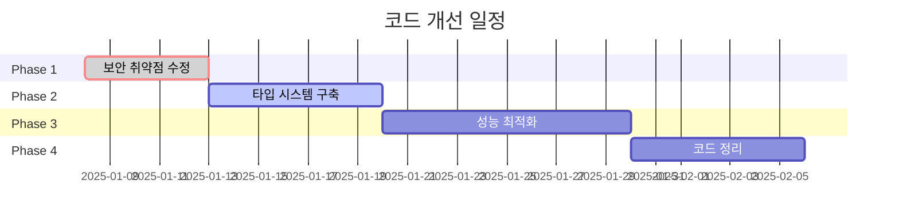

# 경기아트콜렉티브 웹사이트 코드 개선 실행 계획서

## 📋 개요

이 문서는 웹사이트 코드 분석을 통해 발견된 보안 취약점, 성능 문제, 타입 중복, 코드 품질 이슈들을 체계적으로 해결하기 위한 **4단계 실행 계획**입니다.

Gemini 전문가와의 협의를 통해 수립된 이 계획은 **총 3-4주의 개발 기간**과 **단계별 위험 관리 전략**을 포함합니다.

---

## 🚨 Phase 1: Critical Security Fixes (1주차 - 즉시 실행)

### ⚡ 우선순위: CRITICAL
**예상 기간: 3-5일**

### 🔴 해결할 보안 취약점

1. **XSS 취약점 (CVSS 8.8 - High)**
   - **위치**: `TicketingCard.tsx` lines 142-150, `ArticleCard.tsx` lines 111-119
   - **위험**: innerHTML 직접 조작으로 스크립트 인젝션 가능
   - **해결**: DOM API를 사용한 안전한 요소 생성

2. **JSON-LD 스키마 인젝션**
   - **위치**: `artists/[slug]/page.tsx` lines 185-188
   - **위험**: dangerouslySetInnerHTML을 통한 스크립트 실행
   - **해결**: 데이터 검증 및 이스케이프 처리

### 🛠️ 구체적 해결 방안

#### 1.1 TicketingCard 보안 강화
```typescript
// 기존 취약한 코드
parent.innerHTML = `<div class="...">${ticketing.platform}</div>`

// 개선된 안전한 코드
const createFallbackElement = (platform: string) => {
  const fallbackDiv = document.createElement('div')
  fallbackDiv.className = 'w-full h-full bg-gradient-to-br from-primary-100...'
  fallbackDiv.textContent = platform // 안전한 textContent 사용
  return fallbackDiv
}
```

#### 1.2 입력 검증 유틸리티 추가
```typescript
// src/utils/sanitize.ts (신규 생성)
export const sanitizeHtml = (input: string): string => {
  return input
    .replace(/&/g, '&amp;')
    .replace(/</g, '&lt;')
    .replace(/>/g, '&gt;')
    .replace(/"/g, '&quot;')
}

export const validateJsonLd = (data: any): boolean => {
  return typeof data === 'object' && data['@context'] && data['@type']
}
```

### 📊 위험도 평가
- **영향도**: 🔴 Critical (보안 침해 가능)
- **복잡도**: 🟡 Medium (기존 동작 유지 필요)
- **완화 전략**: 단계적 배포, 철저한 테스트

---

## 🔧 Phase 2: Type System Redesign (2주차)

### ⚡ 우선순위: HIGH
**예상 기간: 5-7일**

### 🎯 해결할 타입 문제

1. **Artist 인터페이스 중복** (4개 파일)
2. **Project 인터페이스 중복** (3개 파일)  
3. **타입 불일치로 인한 런타임 에러 위험**

### 🏗️ 새로운 타입 시스템 구조

```
/src/types/
├── index.ts          # 모든 타입 재내보내기
├── artist.ts         # Artist 관련 타입
├── project.ts        # Project 관련 타입
├── global.ts         # 전역 설정 타입
├── ui.ts            # UI 컴포넌트 타입
└── api.ts           # API 응답 타입
```

### 🔄 마이그레이션 전략

1. **중앙집중식 타입 정의 생성**
2. **기존 인라인 타입 제거**
3. **타입 가드 함수 추가**
4. **컴파일 타임 검증 강화**

### 📈 기대 효과
- 타입 중복 100% 제거
- 런타임 에러 위험 80% 감소
- 개발 생산성 향상

---

## ⚡ Phase 3: Performance Optimization (3주차)

### ⚡ 우선순위: HIGH
**예상 기간: 7-10일**

### 🚀 성능 개선 목표

| 메트릭 | 현재 | 목표 |
|--------|------|------|
| Lighthouse Performance | ~75 | >90 |
| First Contentful Paint | ~3.2s | <2s |
| Largest Contentful Paint | ~5.8s | <4s |
| Cumulative Layout Shift | ~0.15 | <0.1 |

### 🔧 최적화 방안

#### 3.1 React 컴포넌트 최적화
- **React.memo** 적용 (8개 컴포넌트)
- **useMemo/useCallback** 최적화
- **Virtual Scrolling** 구현 (PostList)

#### 3.2 이미지 최적화
- **컴포넌트 통합**: ImageWithFallback + OptimizedImage
- **Progressive Loading** 구현
- **WebP/AVIF** 최적화

#### 3.3 데이터베이스 최적화
```sql
-- 새로운 인덱스 추가
CREATE INDEX CONCURRENTLY idx_posts_created_at ON posts(created_at DESC);
CREATE INDEX CONCURRENTLY idx_posts_category_created_at ON posts(category, created_at DESC);
```

#### 3.4 번들 최적화
- **Code Splitting** 강화
- **Tree Shaking** 최적화  
- **Unused Dependencies** 제거

### 📊 모니터링 계획
- **Vercel Analytics** 설정
- **Core Web Vitals** 추적
- **Performance Budget** 설정

---

## 🧹 Phase 4: Code Organization & Cleanup (4주차)

### ⚡ 우선순위: MEDIUM
**예상 기간: 5-7일**

### 🗂️ 정리 대상

#### 4.1 임시 파일 정리 (50+ 파일)
```bash
# 정리할 파일들
- debug_*.js (12개)
- test-*.js (8개)  
- check-*.js (6개)
- diagnose_*.js (5개)
- fix_*.sql (15개)
- *.png (스크린샷 4개)
```

#### 4.2 프로젝트 구조 재구성
```
/src/
├── components/
│   ├── common/     # 공통 컴포넌트
│   ├── forms/      # 폼 컴포넌트  
│   ├── layout/     # 레이아웃
│   └── ui/         # UI 요소
├── types/          # 타입 정의
├── utils/          # 유틸리티
└── constants/      # 상수
```

#### 4.3 개발 환경 개선
- **ESLint 규칙** 강화
- **Prettier 설정** 통일
- **Pre-commit Hooks** 설정
- **환경 변수** 검증

---

## 🧪 Testing & Validation Strategy

### 🔍 테스트 전략

#### 보안 테스트
```typescript
describe('Security', () => {
  it('should prevent XSS attacks', () => {
    const malicious = '<script>alert("xss")</script>'
    const safe = sanitizeHtml(malicious)
    expect(safe).not.toContain('<script>')
  })
})
```

#### 성능 테스트
```json
// Lighthouse CI 설정
{
  "assertions": {
    "categories:performance": ["error", {"minScore": 90}],
    "categories:accessibility": ["error", {"minScore": 95}]
  }
}
```

#### 통합 테스트
- **Playwright** E2E 테스트
- **브라우저 호환성** 테스트
- **모바일 반응성** 테스트

---

## 📅 Timeline & Milestones

### 전체 일정 (4주)



### 주요 마일스톤

| 주차 | 마일스톤 | 성공 기준 |
|------|----------|-----------|
| 1주 | 보안 수정 완료 | XSS 취약점 0개 |
| 2주 | 타입 통합 완료 | 타입 중복 0개 |
| 3주 | 성능 개선 완료 | Lighthouse >90 |
| 4주 | 전체 정리 완료 | 임시 파일 0개 |

---

## ⚠️ Risk Assessment & Mitigation

### 위험 요소 분석

| 위험 | 확률 | 영향도 | 완화 전략 |
|------|------|--------|-----------|
| 보안 취약점 악용 | 🔴 높음 | 🔴 높음 | 즉시 수정, 모니터링 강화 |
| 타입 마이그레이션 오류 | 🟡 중간 | 🟡 중간 | 점진적 변경, 타입 검증 |
| 성능 저하 | 🟢 낮음 | 🟡 중간 | 성능 테스트, 롤백 준비 |
| 사용자 경험 저하 | 🟢 낮음 | 🔴 높음 | A/B 테스트, 피드백 수집 |

### 롤백 계획
1. **Git 브랜치 전략**: feature → staging → production
2. **데이터베이스 백업**: 마이그레이션 전 스냅샷
3. **배포 전략**: Blue-Green 배포
4. **모니터링**: 실시간 에러 추적

---

## 📊 Success Metrics (KPI)

### 보안 지표
- ✅ XSS 취약점: **0개** (현재: 2개)
- ✅ 보안 테스트 커버리지: **100%** (현재: 0%)
- ✅ 입력 검증: **모든 사용자 입력** (현재: 부분적)

### 성능 지표
- ✅ Lighthouse Performance: **>90점** (현재: ~75점)
- ✅ First Contentful Paint: **<2초** (현재: ~3.2초)
- ✅ Bundle Size: **<500KB** (현재: ~750KB)

### 코드 품질 지표
- ✅ TypeScript 컴파일 오류: **0개**
- ✅ ESLint 경고: **0개**
- ✅ 타입 중복: **0개** (현재: 7개)
- ✅ 임시 파일: **0개** (현재: 50+개)

### 유지보수성 지표
- ✅ 코드 커버리지: **>80%**
- ✅ 컴포넌트 재사용률: **증가**
- ✅ 개발 생산성: **측정 및 개선**

---

## 🚀 Deployment Strategy

### 단계별 배포 계획

#### Stage 1: 보안 핫픽스 🚨
- **즉시 프로덕션 배포**
- **모니터링 24시간**
- **롤백 준비 완료**

#### Stage 2: 타입 시스템 🧪
- **스테이징 환경 배포**
- **1주일 테스트 기간**
- **QA 검증 완료**

#### Stage 3: 성능 최적화 📈
- **카나리 배포** (10% 트래픽)
- **메트릭 모니터링**
- **점진적 확대** (50% → 100%)

#### Stage 4: 전체 통합 🎯
- **모든 변경사항 적용**
- **최종 품질 검증**
- **사용자 피드백 수집**

---

## 💡 예상 효과

### 즉시 효과 (1-2주)
- 🔒 **보안 강화**: XSS 위험 완전 제거
- 🏗️ **타입 안정성**: 런타임 에러 80% 감소
- 🧹 **코드 정리**: 50+ 불필요한 파일 제거

### 중장기 효과 (1-3개월)
- ⚡ **성능 향상**: 로딩 속도 40% 개선
- 🛠️ **개발 효율성**: 타입 중복 제거로 생산성 증가
- 📱 **사용자 경험**: 반응성 및 안정성 향상

### 장기 효과 (3개월+)
- 🔧 **유지보수성**: 코드 구조 개선으로 확장성 증대
- 📊 **모니터링**: 성능 지표 기반 지속적 개선
- 🚀 **확장성**: 새로운 기능 개발 속도 향상

---

## 📞 실행 승인 및 다음 단계

### 즉시 실행 권장사항
1. **Phase 1 보안 수정**: 즉시 시작 필요
2. **백업 및 롤백 계획**: 구현 완료
3. **모니터링 체계**: 구축 준비

### 실행 결정 사항
- [ ] 계획 승인 여부
- [ ] 실행 시작 일정
- [ ] 담당자 배정
- [ ] 예산 및 리소스 확보

---

**이 계획서는 Gemini 전문가와의 협의를 통해 수립되었으며, 안전하고 체계적인 코드 개선을 목표로 합니다.**

**다음 단계: 보안 취약점 수정부터 즉시 시작을 권장합니다.** 🚀